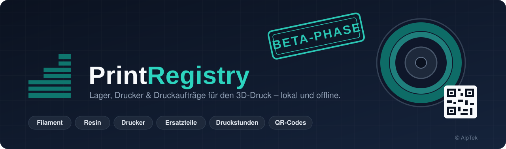
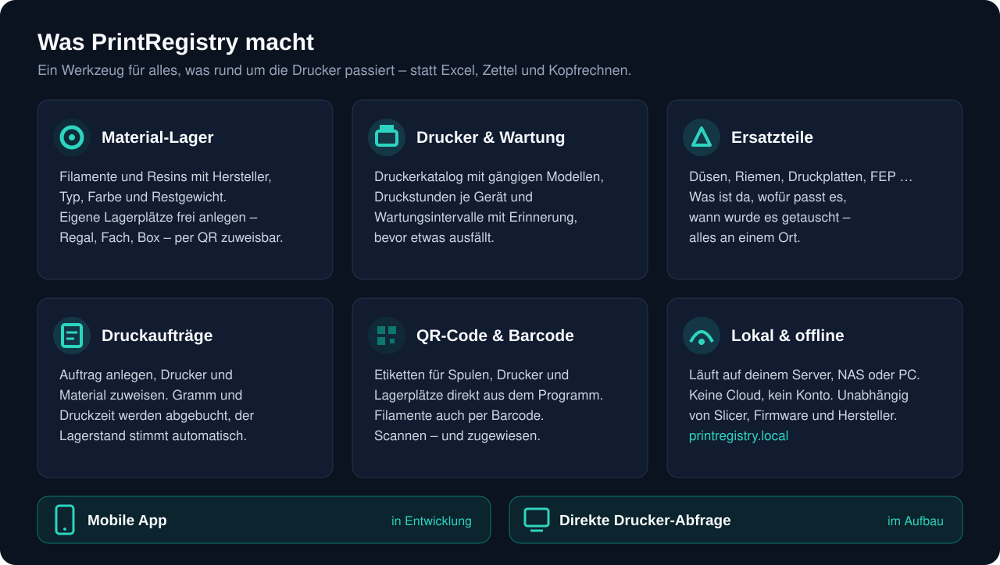
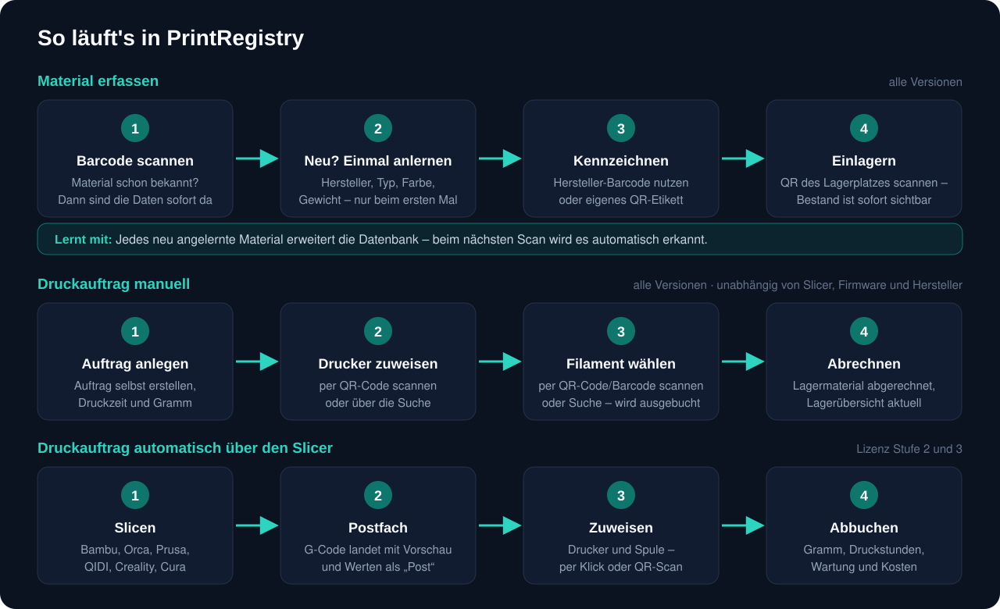
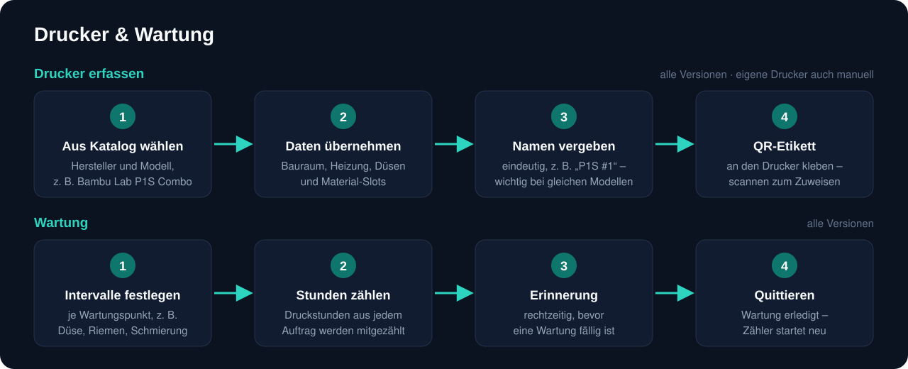
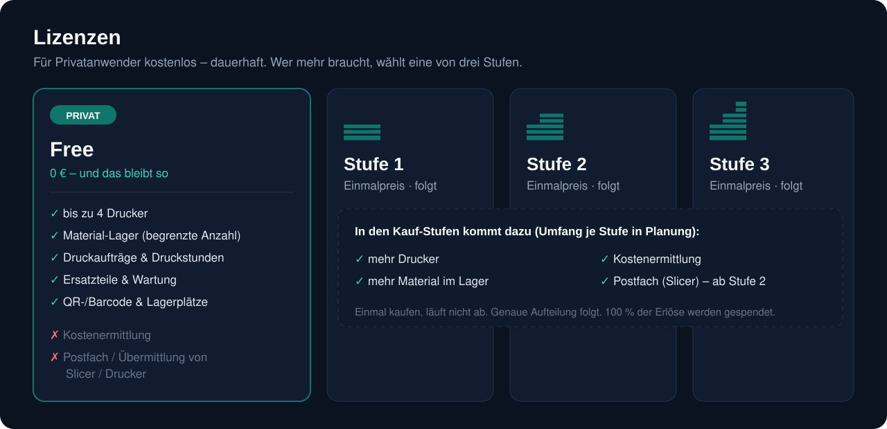
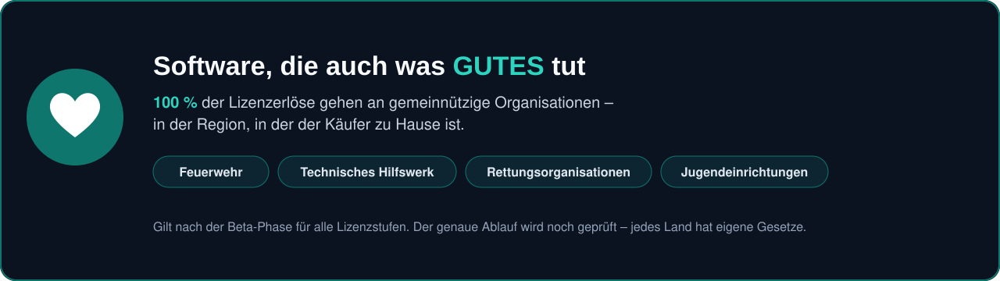
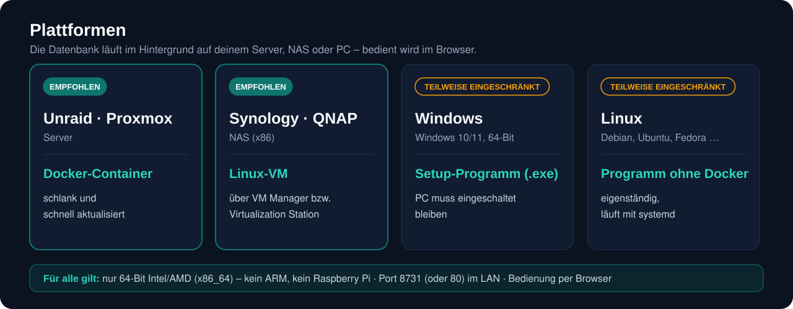
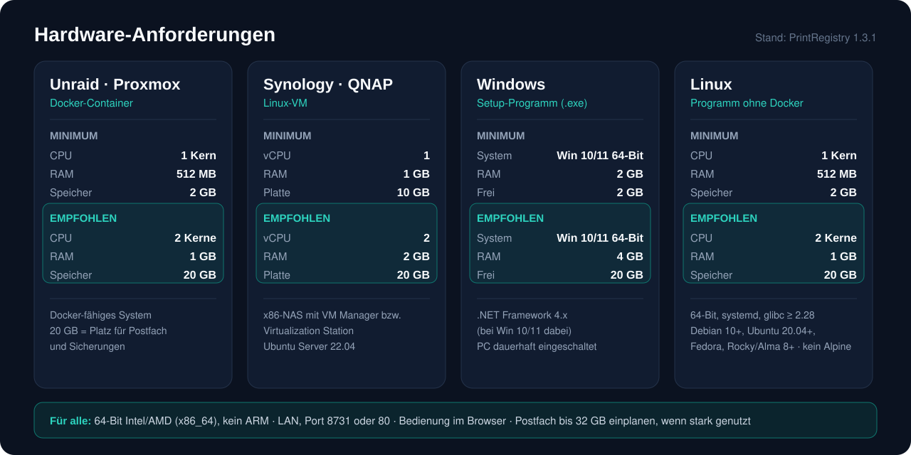

  

  &nbsp;&nbsp;
  

  
  
  
  
  
  

  

# PrintRegistry

**PrintRegistry** ist eine Verwaltungssoftware für alle, die mit 3D-Druckern arbeiten – vom Hobbykeller mit zwei Druckern bis zur kleinen Druckfarm.
Sie ersetzt Excel-Listen, Zettel an der Spule und das Kopfrechnen nach jedem Druck: Wie viel Filament ist noch da? Wie viele Stunden hat der Drucker schon? Wann ist die nächste Wartung fällig? Was hat dieser Druck gekostet?

PrintRegistry läuft **lokal auf deinem eigenen Server oder PC** – ohne Cloud, ohne Konto, ohne Datenübertragung an Dritte.

---

## Warum ich PrintRegistry entwickle

Ich bin seit 2012 im 3D-Druck unterwegs und habe seitdem einige Drucker durch meine Hände gehen lassen. Was mich in den letzten Jahren aber immer mehr auf die Palme gebracht hat: das Chaos. Viel Material, viele Spulen, viele Resinflaschen – und immer öfter die Frage: *Wo liegt das jetzt eigentlich?*

Irgendwann war klar: Da muss ich was machen.

Seit fast neun Jahren bin ich fixer Fachbesucher auf der Formnext. Dort kommt man mit den bekannten Gesichtern ins Gespräch, und über die letzten zwei Jahre ist die Idee immer weiter gereift. Es gibt zwar Software, die in diese Richtung geht – aber das Handling hat mir nie gefallen. Ich wollte etwas Einfacheres. Etwas, das wirklich Zeit spart.

Ich komme aus der Industrie. Dort gilt: Software soll Arbeit abnehmen und das Leben leichter machen – nicht komplizierter. Genau das ist der Anspruch an PrintRegistry.

Im Moment rollt die Software in der **Beta-Phase** aus. Der offizielle **Launch ist für Anfang 2027 geplant.**

— *Clemens, AlpTek*

---

## Wofür ist PrintRegistry gedacht?

- **Für Maker und Privatanwender**, die den Überblick über ihr Material und ihre Drucker behalten wollen.
- **Für kleine Werkstätten und Druckfarmen**, die Aufträge sauber zuweisen und Material sowie Druckstunden abrechnen müssen.
- **Für alle, die ihre Daten im eigenen Netzwerk behalten** möchten.

  

## Was PrintRegistry kann

| Bereich | Funktion |
|---|---|
| 🧵 **Material-Lager** | Filamente und Resins mit Hersteller, Typ, Farbe, Restgewicht und Mindestbestand – jederzeit Übersicht, was im Lager liegt |
| 🗄️ **Lagerplätze** | Individuelle Lagerplatzverwaltung (Regal, Fach, Box …), jeder Lagerplatz per QR-Code zuweisbar |
| 🖨️ **Drucker** | Druckerkatalog mit gängigen Modellen (Bambu Lab, Prusa, QIDI, Creality, Elegoo, Anycubic u. a.), Multimaterial-Slots, Druckstunden je Gerät |
| 🔧 **Wartung** | Wartungsintervalle nach Druckstunden, Erinnerung bevor etwas fällig wird |
| 📦 **Ersatzteile** | Düsen, Riemen, Druckplatten, FEP & Co. – was ist da, wofür passt es, wann wurde getauscht |
| 📋 **Druckaufträge** | Auftrag manuell anlegen, Drucker per QR-Code oder Suche zuweisen, Filament auswählen und ausbuchen – Material und Druckzeit werden abgerechnet |
| 🔳 **QR-Code & Barcode** | Etiketten für Spulen, Drucker und Lagerplätze direkt aus dem Programm; Filamente auch per Barcode verwaltbar |
| 💶 **Kostenermittlung** | Material, Druckstunden und Kosten pro Auftrag *(Kauf-Lizenz)* |
| 📥 **Postfach / Datenübermittlung** | G-Code aus dem Slicer landet mit Vorschaubild und Werten als „Post“ in PrintRegistry *(Lizenz Stufe 2 und 3)* |
| 🔌 **Direkte Drucker-Abfrage** | Aufträge direkt vom Drucker abrufen – *im Aufbau* |
| 💾 **Datensicherung** | Interne Tagessicherungen und Backup-Export |

## So funktioniert's

  

### Material erfassen – in allen Versionen

Bevor gedruckt wird, kommt das Material ins Lager:

1. **Barcode scannen** – den Barcode auf der Spule oder Flasche scannen. Kennt PrintRegistry das Material schon, sind alle Daten sofort da.
2. **Neu? Einmal anlernen** – ist das Material noch unbekannt, trägst du Hersteller, Materialtyp (z. B. PLA, PETG, Resin), Farbe und Gewicht bzw. Inhalt **einmal** ein.
3. **Kennzeichnen** – du kannst einfach den **vorhandenen Hersteller-Barcode** weiterverwenden. Wer lieber eigene Etiketten möchte, druckt sich aus PrintRegistry ein QR-Etikett mit eindeutiger Nummer.
4. **Einlagern** – den QR-Code des Lagerplatzes scannen (Regal, Fach, Box …). Ab jetzt weißt du immer, was wo liegt und wie viel noch da ist.

> 🧠 **PrintRegistry lernt mit:** Jedes neu angelernte Material erweitert die Datenbank. Beim nächsten Scan desselben Produkts wird es automatisch erkannt – je länger du PrintRegistry nutzt, desto weniger musst du tippen.

### Druckauftrag manuell – in allen Versionen, auch Free

1. **Auftrag anlegen** – Druckauftrag selbst erstellen, mit Druckzeit und Gramm.
2. **Drucker zuweisen** – QR-Code am Drucker scannen oder über die Suche auswählen.
3. **Filament wählen** – QR-Code oder Barcode der Spule scannen oder über die Suche auswählen; sie wird ausgebucht.
4. **Abrechnen** – das Lagermaterial wird abgerechnet, die Lagerübersicht ist sofort aktuell.

### Druckauftrag automatisch über den Slicer – Lizenz Stufe 2 und 3

1. **Slicen** – wie gewohnt in Bambu Studio, OrcaSlicer, PrusaSlicer, QIDI Studio, Creality Print oder Cura.
2. **Postfach** – der G-Code wird zusätzlich in den PrintRegistry-Ordner exportiert und erscheint dort mit Vorschau, Druckzeit und Gramm.
3. **Zuweisen** – Drucker und Spule auswählen, per Klick oder QR-Scan.
4. **Abbuchen** – Material, Druckstunden und Wartungszähler werden automatisch aktualisiert.

Das funktioniert unabhängig von Slicer-Version und Drucker-Firmware.

### Unabhängig von Slicer, Firmware und Hersteller

PrintRegistry läuft **autonom**. Es hängt nicht an einer Slicer- oder Firmware-Schnittstelle, die im Hintergrund geändert werden kann.
Egal welche Software dein Drucker hat und egal was ein Hersteller künftig an seinen Bedingungen ändert: **Der manuelle Modus funktioniert immer weiter.**

---

## Drucker & Wartung

  

### Drucker erfassen

Drucker werden aus einem **Druckerkatalog** mit gängigen Modellen gewählt (u. a. Bambu Lab, Prusa, QIDI, Creality, Elegoo, Anycubic, Snapmaker, Flashforge, Sovol – FDM und Resin). Die technischen Daten werden übernommen, du vergibst nur noch einen Namen. Nicht gelistete Geräte legst du als **„Eigener Drucker (manuell)“** an.

**Beispiel: Bambu Lab P1S Combo**

| Feld | Wird angelegt als |
|---|---|
| Hersteller / Modell | Bambu Lab · P1S Combo |
| Technik | FDM |
| Bauraum | 256 × 256 × 256 mm |
| Multimaterial | AMS – 4 Material-Slots werden automatisch angelegt |
| Name | frei wählbar, z. B. „P1S #1“ |
| QR-Code | Etikett für den Drucker – zum Zuweisen per Scan |
| Druckstunden | werden ab jetzt mitgezählt |

Bei Combo-Modellen mit Mehrfach-Materialzufuhr legt PrintRegistry die passenden Slots gleich mit an – bei Einzelgeräten einen Slot.

### Wartung

Jeder Drucker bekommt seine **Wartungspunkte mit Intervall**, zum Beispiel Düse reinigen oder tauschen, Riemen prüfen oder Achsen schmieren. Beim Resin-Drucker z. B. FEP-Folie oder Tank.

1. **Intervalle festlegen** – je Wartungspunkt, nach Druckstunden.
2. **Stunden zählen** – die Druckstunden aus jedem abgeschlossenen Auftrag werden automatisch mitgezählt.
3. **Erinnerung** – PrintRegistry meldet sich rechtzeitig, bevor eine Wartung fällig ist.
4. **Quittieren** – Wartung als erledigt markieren, der Zähler für diesen Punkt startet neu. Die Wartungen bleiben als Verlauf beim Drucker gespeichert.

---

## Lizenzen

  

PrintRegistry ist **keine Open-Source-Software**. Der Quellcode ist nicht öffentlich.

- **Hobby-Nutzer:** kostenlos – und das bleibt so (im Rahmen der Free-Version).
- **Stufe 1–3:** einmaliger Fixpreis. **Die Software läuft nicht ab.**
- **Erweiterungen**, die später dazukommen, sind kostenpflichtig.

| | **Free (Privat)** | **Stufe 1** | **Stufe 2** | **Stufe 3** |
|---|:---:|:---:|:---:|:---:|
| Preis | **0 €, dauerhaft** | Einmalpreis, folgt | Einmalpreis, folgt | Einmalpreis, folgt |
| Drucker | bis zu **4** | mehr | mehr | mehr |
| Material im Lager | begrenzt | mehr | mehr | mehr |
| Druckaufträge & Druckstunden | ✅ | ✅ | ✅ | ✅ |
| Ersatzteile & Wartung | ✅ | ✅ | ✅ | ✅ |
| Lagerplätze, QR-Code & Barcode | ✅ | ✅ | ✅ | ✅ |
| Datensicherung | ✅ | ✅ | ✅ | ✅ |
| Kostenermittlung | ❌ | ✅ | ✅ | ✅ |
| Postfach / Datenübermittlung Slicer | ❌ | ❌ | ✅ | ✅ |

> ℹ️ Die genaue Aufteilung der drei Kauf-Stufen (Preise, Limits, Funktionen) wird noch festgelegt und hier ergänzt.
> Die Beta-Versionen sind zeitlich begrenzt – die fertigen Lizenzen ab dem Launch laufen nicht ab.

---

## Software, die auch was Gutes tut

  

PrintRegistry ist in meiner Freizeit entstanden – in erster Linie, weil ich sie selbst gebraucht habe. Deshalb möchte weder ich noch meine Firma daran verdienen.

**Nach der Beta-Phase, ab der aktiven Version, soll der Betrag aus allen Lizenzstufen, für die eine Lizenz gekauft wird, zu 100 % an öffentliche, soziale und gemeinnützige Organisationen gehen.** Zum Beispiel an:

- die Feuerwehr
- das Technische Hilfswerk
- Rettungsorganisationen
- Jugendeinrichtungen

Also Einrichtungen, die am Ende jedem von uns helfen.

Die Spende soll in **der Region bleiben, in der der Käufer zu Hause ist** – so hat jeder, der eine Lizenz kauft, auch selbst etwas davon. Nach aktuellem Plan fließen die Beträge direkt an die Organisationen, ohne dass ich dazwischen beteiligt bin.

Wie das Ganze genau abläuft, wird noch geprüft – denn jedes Land hat eigene Gesetze, auch steuerrechtlich. Fest steht aber: **Diese Software soll auch was Gutes tun.**

---

## Plattformen

  

Die Datenbank läuft im Hintergrund auf deinem eigenen Server, NAS oder PC. Bedient wird PrintRegistry über den Browser – am PC, Tablet oder Handy.

| Plattform | Variante | Status |
|---|---|---|
| **Unraid / Proxmox** | Docker-Container | ✅ empfohlen |
| **Synology / QNAP** | Linux-VM | ✅ empfohlen |
| **Windows** | Setup-Programm (.exe) | ⚠️ momentan teilweise eingeschränkt |
| **Linux** | eigenständiges Programm (ohne Docker) | ⚠️ momentan teilweise eingeschränkt |

Im Netzwerk erreichbar unter **`http://printregistry.local`** – oder per QR-Code direkt am Handy.

## Hardware-Anforderungen

  

*Stand: PrintRegistry 1.3.1*

> **Für alle Plattformen gilt:** nur **64-Bit Intel/AMD (x86_64)** – **kein ARM** (Raspberry Pi und ARM-NAS werden nicht unterstützt). Netzwerk im LAN, Port **8731** (oder 80). Bedienung im Browser – auch per Handy oder Tablet im selben Netz.

### Unraid / Proxmox (Docker-Container)

| | CPU | RAM | Speicher | Sonstiges |
|---|---|---|---|---|
| **Minimum** | 1 Kern | 512 MB | 2 GB | Docker-fähig |
| **Empfohlen** | 2 Kerne | 1 GB | 20 GB | Platz für Postfach und Sicherungen |

### Synology / QNAP (als Linux-VM – empfohlener Weg)

**Voraussetzung:** NAS mit Virtualisierung – Synology *Virtual Machine Manager* bzw. QNAP *Virtualization Station*. Nur x86-NAS, kein ARM.

| | vCPU | RAM | Virtuelle Platte | Sonstiges |
|---|---|---|---|---|
| **Minimum** | 1 | 1 GB | 10 GB | Ubuntu Server 22.04 |
| **Empfohlen** | 2 | 2 GB | 20 GB | |
| **Container-Alternative** | – | 512 MB | 2 GB | |

### Windows (Setup-Programm)

| | System | RAM | Freier Speicher | Sonstiges |
|---|---|---|---|---|
| **Minimum** | Windows 10/11, 64-Bit | 2 GB | 2 GB | .NET Framework 4.x (bei Windows 10/11 bereits dabei) |
| **Empfohlen** | Windows 10/11, 64-Bit | 4 GB | 20 GB | dauerhaft eingeschalteter PC oder Mini-PC, damit der Server erreichbar bleibt |

### Linux (eigenständiges Programm, ohne Docker)

**Voraussetzung:** 64-Bit, systemd, glibc ≥ 2.28 – z. B. Debian 10+, Ubuntu 20.04+, Fedora, Rocky/Alma 8+. **Nicht Alpine.**

| | CPU | RAM | Speicher |
|---|---|---|---|
| **Minimum** | 1 Kern | 512 MB | 2 GB |
| **Empfohlen** | 2 Kerne | 1 GB | 20 GB |

### Zugriffsgerät (Bedienung, keine Installation)

Aktueller Browser (Chrome, Edge, Firefox, Safari) auf PC, Tablet oder Handy im selben Netzwerk.

### Speicher-Hinweis

- Reine Datenbank und Sicherungen: wenige MB bis einige hundert MB.
- Das **Postfach** (hochgeladene Slicer-Dateien) kann groß werden. Das Limit lässt sich in den Einstellungen festlegen (Standard bis 32 GB). Wer das Postfach stark nutzt, sollte entsprechend mehr Speicher einplanen.

**In Entwicklung:**

- 📱 **Mobile App** für Smartphone und Tablet
- 🔌 **Direkte Drucker-Abfrage** – Aufträge direkt vom Drucker abrufen (im Aufbau)

## Status

PrintRegistry befindet sich aktuell in der **Beta-Phase**. Der Launch ist für **Anfang 2027** geplant. Downloads, Anleitungen und Neuigkeiten folgen hier im Repository.

**Feedback & Fehler:** gerne über die [Issues](../../issues).

## Kaffee

  

<b>Der Entwickler dankt für den Kaffee ☕</b>

  

---

  © AlpTek · PrintRegistry ist urheberrechtlich geschützt. Alle Rechte vorbehalten.

