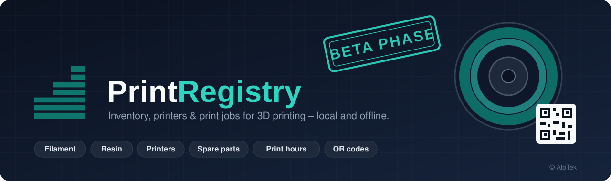
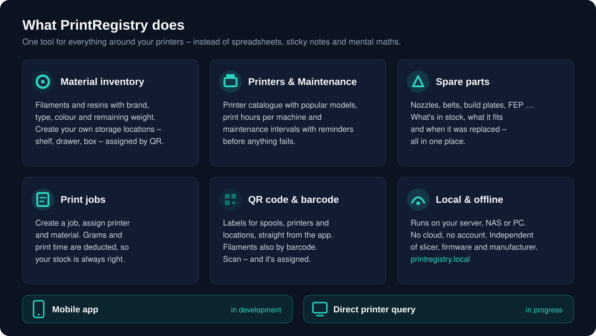
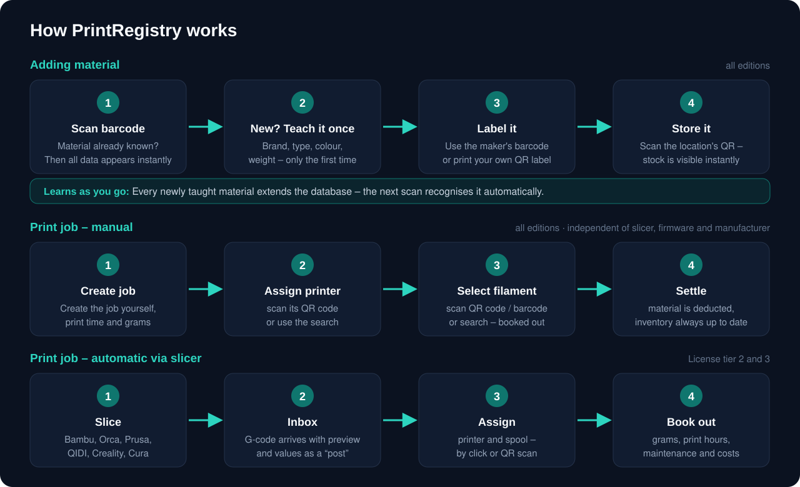
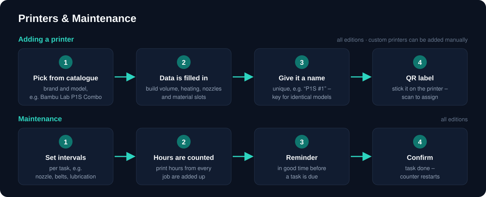
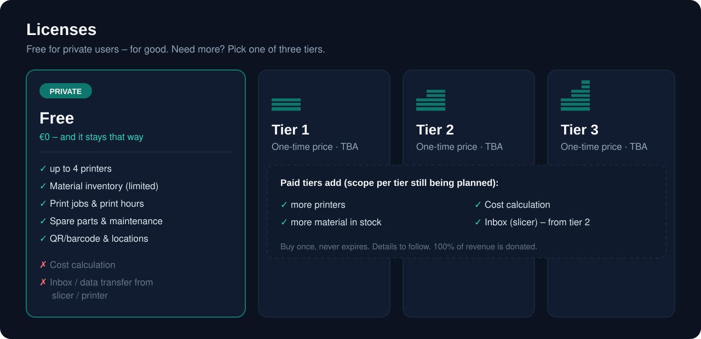
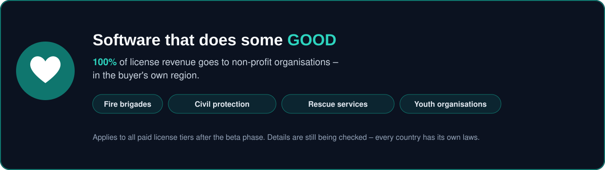
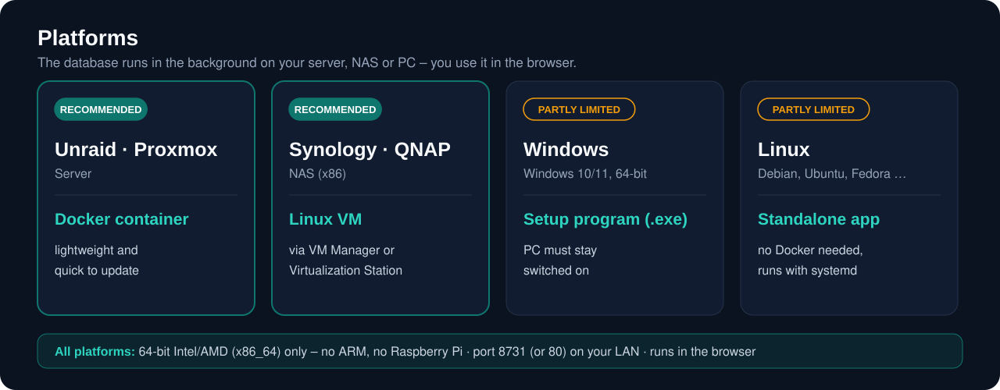
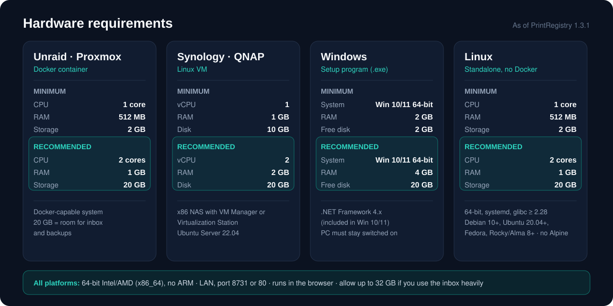

  

  &nbsp;&nbsp;
  

  
  
  
  
  
  

  

# PrintRegistry

**PrintRegistry** is management software for anyone who works with 3D printers – from a hobby corner with two machines to a small print farm.
It replaces spreadsheets, notes stuck to spools and the mental maths after every print: How much filament is left? How many hours has this printer run? When is the next maintenance due? What did this print actually cost?

PrintRegistry runs **locally on your own server or PC** – no cloud, no account, no data sent to third parties.

---

## Why I'm building PrintRegistry

I've been into 3D printing since 2012, and quite a few printers have passed through my hands since then. What drove me up the wall more and more over the last few years was the chaos. Lots of material, lots of spools, lots of resin bottles – and more and more often the question: *Where on earth did I put that?*

At some point it was clear: I had to do something about it.

For almost nine years I've been a regular trade visitor at Formnext. That's where you end up talking to the familiar faces, and over the last two years the idea kept maturing. There is software out there that goes in this direction – but I never liked how it handled. I wanted something simpler. Something that genuinely saves time.

I come from industry, where the rule is simple: software should take work off your hands and make life easier – not more complicated. That's exactly what PrintRegistry aims to do.

Right now the software is rolling out in its **beta phase**. The official **launch is planned for early 2027.**

— *Clemens, AlpTek*

---

## Who is PrintRegistry for?

- **Makers and private users** who want to keep track of their material and printers.
- **Small workshops and print farms** that need to assign jobs properly and account for material and print hours.
- **Anyone who wants to keep their data on their own network.**

  

## What PrintRegistry can do

| Area | Feature |
|---|---|
| 🧵 **Material inventory** | Filaments and resins with brand, type, colour, remaining weight and minimum stock – always know what's on the shelf |
| 🗄️ **Storage locations** | Your own storage locations (shelf, drawer, box …), each one assignable by QR code |
| 🖨️ **Printers** | Printer catalogue with popular models (Bambu Lab, Prusa, QIDI, Creality, Elegoo, Anycubic and more), multi-material slots, print hours per machine |
| 🔧 **Maintenance** | Maintenance intervals based on print hours, with a reminder before anything is due |
| 📦 **Spare parts** | Nozzles, belts, build plates, FEP & co. – what's in stock, what it fits, when it was replaced |
| 📋 **Print jobs** | Create jobs manually, assign the printer by QR code or search, select and book out the filament – material and print time are accounted for |
| 🔳 **QR code & barcode** | Labels for spools, printers and storage locations straight from the app; filaments can also be managed by barcode |
| 💶 **Cost calculation** | Material, print hours and cost per job *(paid license)* |
| 📥 **Inbox / data transfer** | G-code from your slicer arrives in PrintRegistry as a “post” with preview image and values *(license tier 2 and 3)* |
| 🔌 **Direct printer query** | Fetch jobs directly from the printer – *in progress* |
| 💾 **Backups** | Internal daily backups and backup export |

## How it works

  

### Adding material – all editions

Before you print, the material goes into your inventory:

1. **Scan barcode** – scan the barcode on the spool or bottle. If PrintRegistry already knows the material, all data appears instantly.
2. **New? Teach it once** – if the material is unknown, enter brand, material type (e.g. PLA, PETG, resin), colour and weight or volume **once**.
3. **Label it** – simply keep using the **manufacturer's existing barcode**. If you prefer your own labels, print a QR label with a unique number from PrintRegistry.
4. **Store it** – scan the QR code of the storage location (shelf, drawer, box …). From now on you always know what's where and how much is left.

> 🧠 **PrintRegistry learns as you go:** Every newly taught material extends the database. The next time you scan the same product, it is recognised automatically – the longer you use PrintRegistry, the less you have to type.

### Print job – manual, all editions including Free

1. **Create job** – create the print job yourself, with print time and grams.
2. **Assign printer** – scan the QR code on the printer or pick it via search.
3. **Select filament** – scan the spool's QR code or barcode, or pick it via search; it gets booked out.
4. **Settle** – the material is deducted from your inventory, and the stock overview is up to date immediately.

### Print job – automatic via slicer, license tier 2 and 3

1. **Slice** – as usual in Bambu Studio, OrcaSlicer, PrusaSlicer, QIDI Studio, Creality Print or Cura.
2. **Inbox** – the G-code is additionally exported to the PrintRegistry folder and appears there with preview, print time and grams.
3. **Assign** – pick printer and spool, by click or QR scan.
4. **Book out** – material, print hours and maintenance counters are updated automatically.

This works regardless of slicer version and printer firmware.

### Independent of slicer, firmware and manufacturer

PrintRegistry runs **autonomously**. It doesn't depend on a slicer or firmware interface that could be changed behind your back.
Whatever software your printer runs, and whatever a manufacturer changes in its terms in the future: **manual mode keeps working.**

---

## Printers & maintenance

  

### Adding a printer

Printers are picked from a **printer catalogue** of popular models (including Bambu Lab, Prusa, QIDI, Creality, Elegoo, Anycubic, Snapmaker, Flashforge, Sovol – FDM and resin). The technical data is filled in for you; all you do is give it a name. Machines not in the list can be added as a **“custom printer (manual)”**.

**Example: Bambu Lab P1S Combo**

| Field | Created as |
|---|---|
| Brand / model | Bambu Lab · P1S Combo |
| Technology | FDM |
| Build volume | 256 × 256 × 256 mm |
| Multi-material | AMS – 4 material slots are created automatically |
| Name | your choice, e.g. “P1S #1” |
| QR code | label for the printer – assign by scanning |
| Print hours | counted from now on |

For combo models with a multi-material unit, PrintRegistry creates the matching slots straight away – for single-material machines, one slot.

### Maintenance

Every printer gets its own **maintenance tasks with intervals**, for example cleaning or replacing the nozzle, checking belts or lubricating axes. For resin printers, e.g. FEP film or vat.

1. **Set intervals** – per maintenance task, based on print hours.
2. **Hours are counted** – the print hours of every completed job are added up automatically.
3. **Reminder** – PrintRegistry lets you know in good time before a task is due.
4. **Confirm** – mark the task as done and its counter restarts. Completed maintenance is kept as a history on the printer.

---

## Licenses

  

PrintRegistry is **not open-source software**. The source code is not public.

- **Hobby users:** free – and it stays that way (within the scope of the Free edition).
- **Tier 1–3:** one-time fixed price. **The software never expires.**
- **Extensions** added later will be paid.

| | **Free (private)** | **Tier 1** | **Tier 2** | **Tier 3** |
|---|:---:|:---:|:---:|:---:|
| Price | **€0, for good** | one-time, TBA | one-time, TBA | one-time, TBA |
| Printers | up to **4** | more | more | more |
| Material in stock | limited | more | more | more |
| Print jobs & print hours | ✅ | ✅ | ✅ | ✅ |
| Spare parts & maintenance | ✅ | ✅ | ✅ | ✅ |
| Storage locations, QR code & barcode | ✅ | ✅ | ✅ | ✅ |
| Backups | ✅ | ✅ | ✅ | ✅ |
| Cost calculation | ❌ | ✅ | ✅ | ✅ |
| Inbox / slicer data transfer | ❌ | ❌ | ✅ | ✅ |

> ℹ️ The exact split of the three paid tiers (prices, limits, features) is still being defined and will be added here.
> Beta versions are time-limited – the final licenses from launch onwards never expire.

---

## Software that does some good

  

PrintRegistry was built in my spare time – first and foremost because I needed it myself. That's why neither I nor my company want to make money from it.

**After the beta phase, from the active version onwards, the revenue from every paid license tier is meant to go 100% to public, social and non-profit organisations.** For example:

- fire brigades
- civil protection organisations
- rescue services
- youth organisations

In other words, organisations that ultimately help every one of us.

The donation is meant to **stay in the region where the buyer lives** – so everyone who buys a license also benefits from it locally. As currently planned, the money goes directly to the organisations, without me being involved in between.

Exactly how this will work is still being checked – every country has its own laws, including tax rules. But one thing is certain: **this software should also do some good.**

---

## Platforms

  

The database runs in the background on your own server, NAS or PC. You use PrintRegistry in the browser – on a PC, tablet or phone.

| Platform | Variant | Status |
|---|---|---|
| **Unraid / Proxmox** | Docker container | ✅ recommended |
| **Synology / QNAP** | Linux VM | ✅ recommended |
| **Windows** | Setup program (.exe) | ⚠️ currently partly limited |
| **Linux** | Standalone program (no Docker) | ⚠️ currently partly limited |

Reachable on your network at **`http://printregistry.local`** – or via QR code straight on your phone.

## Hardware requirements

  

*As of PrintRegistry 1.3.1*

> **Applies to all platforms:** **64-bit Intel/AMD (x86_64) only** – **no ARM** (Raspberry Pi and ARM-based NAS units are not supported). Network on your LAN, port **8731** (or 80). Used in the browser – including phones and tablets on the same network.

### Unraid / Proxmox (Docker container)

| | CPU | RAM | Storage | Other |
|---|---|---|---|---|
| **Minimum** | 1 core | 512 MB | 2 GB | Docker-capable |
| **Recommended** | 2 cores | 1 GB | 20 GB | room for inbox and backups |

### Synology / QNAP (as Linux VM – recommended)

**Requirement:** NAS with virtualisation – Synology *Virtual Machine Manager* or QNAP *Virtualization Station*. x86 NAS only, no ARM.

| | vCPU | RAM | Virtual disk | Other |
|---|---|---|---|---|
| **Minimum** | 1 | 1 GB | 10 GB | Ubuntu Server 22.04 |
| **Recommended** | 2 | 2 GB | 20 GB | |
| **Container alternative** | – | 512 MB | 2 GB | |

### Windows (setup program)

| | System | RAM | Free disk space | Other |
|---|---|---|---|---|
| **Minimum** | Windows 10/11, 64-bit | 2 GB | 2 GB | .NET Framework 4.x (already included in Windows 10/11) |
| **Recommended** | Windows 10/11, 64-bit | 4 GB | 20 GB | an always-on PC or mini PC, so the server stays reachable |

### Linux (standalone program, no Docker)

**Requirement:** 64-bit, systemd, glibc ≥ 2.28 – e.g. Debian 10+, Ubuntu 20.04+, Fedora, Rocky/Alma 8+. **Not Alpine.**

| | CPU | RAM | Storage |
|---|---|---|---|
| **Minimum** | 1 core | 512 MB | 2 GB |
| **Recommended** | 2 cores | 1 GB | 20 GB |

### Client device (for use, no installation)

A current browser (Chrome, Edge, Firefox, Safari) on a PC, tablet or phone on the same network.

### Storage note

- Database and backups alone: a few MB up to a few hundred MB.
- The **inbox** (uploaded slicer files) can grow large. The limit can be set in the settings (default up to 32 GB). If you use the inbox heavily, plan for more storage accordingly.

**In development:**

- 📱 **Mobile app** for smartphone and tablet
- 🔌 **Direct printer query** – fetch jobs directly from the printer (in progress)

## Status

PrintRegistry is currently in its **beta phase**. The launch is planned for **early 2027**. Downloads, guides and news will follow here in this repository.

**Feedback & bug reports:** welcome via [Issues](../../issues).

## Coffee

  

<b>The developer thanks you for the coffee ☕</b>

  

---

  © AlpTek · PrintRegistry is protected by copyright. All rights reserved.

